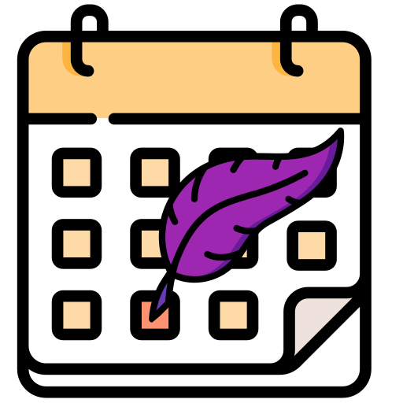

# INTERIMBOT




Un bot telegram qui permet de suivre les missions d'interim et faciliter la vérification des fiches de paye ! :euro: :pen:

## protocole d'installation

Copier le dossier sur le serveur et créer un fichier **.env** qui va contenir le token d'identitification du bot. Il faut ensuite lancer le conteneur docker :
```sh
# récupération du projet sur le serveur
gh repo clone spystrach/interimBot && cd interimBot
# ajoute le token telegram
echo "token={TOKEN}" > .env
# constantes pour envoyer les mails
echo "server_name={smtp.gmail.com}" >> .env
echo "server_port={587}" >> .env
echo "mail_from={EMAIL}" >> .env
echo "mail_mdp={PASSWORD}" >> .env
echo "mail_to={EMAIL}" >> .env
# construit l'image et lance le docker
sh restartInterimBot.sh
```

## protocole de développement

Pour tester et améliorer le bot, il faut télécharger ce dossier en local, créer un environnement virtuel python et lancer le programme :
```sh
# récupération du projet
gh repo clone spystrach/interimBot && cd interimBot
# ajoute le token
echo "token={TOKEN}" > .env
# constantes pour envoyer les mails
echo "server_name={smtp.gmail.com}" >> .env
echo "server_port={587}" >> .env
echo "mail_from={EMAIL}" >> .env
echo "mail_mdp={PASSWORD}" >> .env
echo "mail_to={EMAIL}" >> .env
# environnement virtuel de développement
python3 -m venv venv && source venv/bin/activate
# dépendances
pip3 install -r requirements_dev.txt
# lancer le programme
python3 interimBot.py
```

## protocole de mise à jour

Le script *interimBot_update.py* sert à mettre à jour le bot sur le serveur à partir du dossier distant. Il néccessite un **accès ssh fonctionnel** avec un empreinte ssh enregistrée et une installation locale pour le développement. Il faut ensuite ajouter le nom de l'utilisateur du serveur et le chemin vers le dossier interimBot :
```sh
# ajoute le nom d'utilisateur et le dossier de musicaBot du serveur
echo "username={USERNAME}" >> .env
echo "folder=~/{PATH}/{TO}/{INTERIMBOT}" >> .env
# met à jour le bot
python3 interimBot_update.py
```

Il faut aussi modifier le chemin ligne 4 de *restartInterimBot.sh*

## A FAIRE

- [x] : token d'identitification non hardcodé
- [x] : integrer un Dockerfile au projet
- [x] : mieux gérer les mises à jours coté serveur
